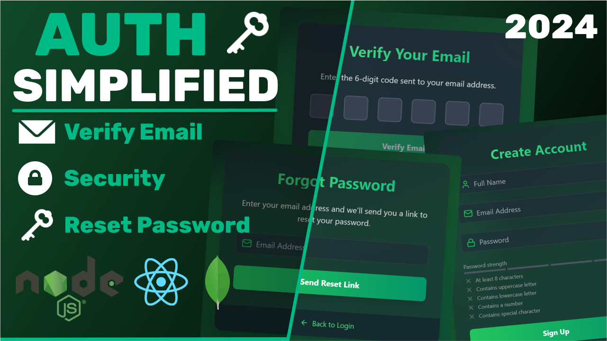

# MERN Authentication System

<div align="center">
    <br />
        
    <br />
    <br />

  <div>
    
    
    
    
    
    
    
    
    
    
  </div>
</div>

---

A production-ready MERN (MongoDB, Express, React, Node.js) Authentication System with JWT-based authentication, OTP email verification, and password reset functionality. The project is built with scalability, maintainability, and security in mind, featuring a Node.js/Express backend and a React (Vite) frontend.

---

### 🚀 Key Features

**🔐 Authentication**

- JWT access tokens stored in HttpOnly cookies for enhanced security
- User registration, login, and logout
- Email verification using one-time passwords (OTPs)
- Forgot/reset password flow with secure token-based reset
- Protected API routes with JWT validation

**📦 Frontend (React + Vite)**

- Client-side routing with React Router
- Form validation with React Hook Form
- Centralized Axios API client for HTTP requests
- Toast notifications for user feedback (React Toastify)
- Responsive UI with TailwindCSS and DaisyUI
- Protected routes using `AuthContext` for global state management

**⚙️ Backend (Node.js + Express)**

- RESTful API with modular controllers and routes
- MongoDB with Mongoose for data persistence
- Email delivery via Nodemailer for OTP and password reset
- Secure password hashing with bcrypt
- Centralized error handling and middleware for rate limiting, security headers, and logging
- Background cleanup of unverified accounts using node-cron

---

### 🛠️ Tech Stack

**Frontend**:

- React (19, Vite)
- React Router
- React Hook Form
- Axios
- Tailwind CSS + daisyUI
- React Toastify
- Lucide React

**Backend**:

- Node.js + Express
- MongoDB + Mongoose
- jsonwebtoken
- bcrypt
- Nodemailer
- cookie-parser
- node-cron
- helmet, cors, morgan, compression

---

### 📂 Project Structure

- **frontend/**: React client with routing, auth context, and API wrappers.
- **backend/**: Express server with modular routes, controllers, and services.

See `frontend/README.md` and `backend/README.md` for detailed folder structures.

---

### ⚙️ Installation Guide

**Prerequisites**

- Node.js 18+
- MongoDB 5+ (local or MongoDB Atlas)
- SMTP account (e.g., Gmail with app password)

**Setup**

1. **Clone the Repository**

   ```bash
   git clone https://github.com/SrjAdhikari/MERN-Auth-System.git
   ```

2. **Backend Setup**

   ```bash
   cd backend
   npm install
   ```

   Create `backend/.env` (see `backend/README.md` for variables).

   ```bash
   npm run dev
   ```

   Backend runs at `http://localhost:4000`.

3. **Frontend Setup**

   ```bash
   cd ../frontend
   npm install
   ```

   Create `frontend/.env`:

   ```env
   VITE_API_BASE_URL=http://localhost:4000/api/v1
   ```

   ```bash
   npm run dev
   ```

   Frontend runs at `http://localhost:5173`.

---

### 📮 API Endpoints

See `backend/README.md` for detailed endpoints, including:

- **Auth**: `/api/v1/auth/register`, `/login`, `/verify-otp`, `/password/forgot`, `/password/reset/:token`, `/logout`
- **User**: `/api/v1/users/me`

---

### 🛡️ Security Best Practices

- **Backend**: HttpOnly cookies, bcrypt hashing, rate limiting, helmet, CORS restrictions.
- **Frontend**: Client-side validation, secure Axios configuration, protected routes.

---

### 🤝 Contributing

Contributions are welcome! Please follow these steps:

1. Fork the repository.
2. Create a feature branch (`git checkout -b feature/YourFeature`).
3. Commit changes (`git commit -m "Add YourFeature"`).
4. Push to the branch (`git push origin feature/YourFeature`).
5. Open a pull request.

---

✍️ **Author**: Suraj Adhikari  
👨‍💻 **Role**: MERN Full Stack Developer
